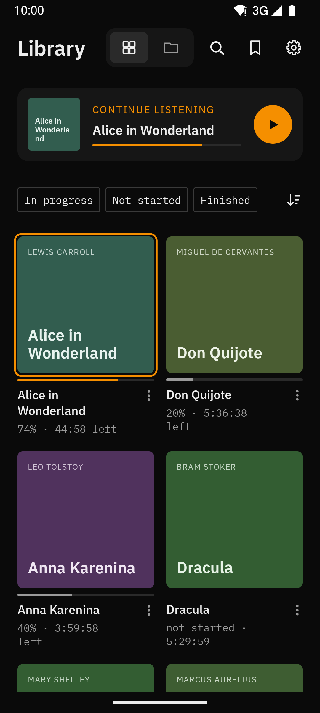

# LECTOR

*Lector*, Latin for reader.

A minimal audiobook player for Android, with covers, bookmarks with notes and tags, and a backup you can take to another phone.


**Download:** the APK is in the [releases](https://github.com/memoriainfinita/LECTOR/releases).



## Library

LECTOR finds the books in the folders you choose. A book can be a folder, a single file, files with the same album, or files with the same name and a number. Disc subfolders ("CD1", "Disc 1 of 3") become one book.

- Grid of covers, with Continue listening on top. Pinch to change from 1 to 3 columns, or a list with covers
- Filters (started, not started, finished), sort, and search inside the library
- Folders view, and a class per folder to decide how its books are grouped
- Join and Split to fix a book that was detected wrong, with Undo
- Covers from the file, or from an image in the book's folder. Books without one get a typographic cover
- Moved or renamed books keep their position and bookmarks

## Listening

- Skip buttons, chapter list, undo a skip, and a large time readout while you drag the bar
- Speed from 0.5x to 3.5x without changing pitch, volume boost, a 5-band voice equalizer and skip silence. Global, or per book
- Two panes in landscape
- Position saved per book, and per file when you jump around
- Sleep timer: minutes, end of chapter, or on a schedule; shake the phone to keep listening
- Notification and lock screen with cover, a resizable widget, and Android Auto

## Bookmarks

A bookmark has an optional title, note and tags. Add one from the player, the notification, the widget or a headset button without looking at the screen. Browse them per book or all together, filter by tag, search, and export as text.

## Buttons

Four configurable buttons in the player, the notification and the widget. Headset with 1, 2 and 3 presses and media keys can each be assigned an action. Pauses when the headset disconnects and resumes if it reconnects within 10 seconds.

## Data

Settings › Data saves a JSON backup with books, positions, bookmarks, tags, corrections and settings. Importing it on another phone merges it with what is there: books are matched by their files, not by their path.

## Formats

mp3, m4a, m4b, aac, ogg, opus, flac, wav, mka, and mp4 or webm without video. Chapters from m4b, mp3 (ID3), mka and webm, or from a `.cue` file next to the audio. wma, aax, aaxc and ape are shown as not supported, with Open with… to play them in another app.

## Look

Dark and light themes, switching by time of day, accent colors, and English and Spanish.

## Permissions

All files access on Android 11 and later, to read the audiobook folders; storage permission on Android 8 to 10.

## Building from source

Requires JDK 17 or later and the Android SDK (API 37).

```bash
./gradlew assembleDebug        # debug APK
./gradlew testDebugUnitTest    # unit tests
./gradlew assembleRelease      # release APK, unsigned without a key
```

The release is signed when the Gradle properties `lectorStoreFile`, `lectorStorePassword`, `lectorKeyAlias` and `lectorKeyPassword` are set, for example in `~/.gradle/gradle.properties`.

## License

GPL-3.0. See `LICENSE`.

## Credits

Developed by [@memoriainfinita](https://github.com/memoriainfinita) with the assistance of Claude (Anthropic).

Inspired by [Simple Audiobook Player](https://play.google.com/store/apps/details?id=mdmt.sabp.free) and [Voice](https://github.com/PaulWoitaschek/Voice); no code from either.
